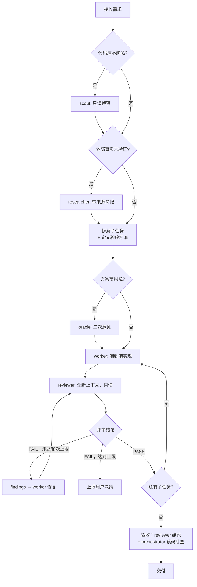

# orchestrator-skill

[](https://skills.sh/sapjax/orchestrator-skill)
[](LICENSE)

[English](README.md) | **简体中文**

一个让你的 AI 编程助手（Claude Code、Cursor、Codex、OpenCode、pi、Antigravity 等）担任高层**统筹负责人（Orchestrator）**的 agent skill：它负责方针制定、任务拆解、委派调度与最终验收，**绝不亲自编写实现代码**。


---

## 🎭 角色体系

| 角色 | 职责 | 权限 | 何时启用 |
| --- | --- | --- | --- |
| **orchestrator**（主会话） | 对*交付*负责——方针、拆解、仲裁、验收 | 可读代码（只为判断，绝不实现） | 始终 |
| **scout 勘察** | 快速代码侦察：相关文件、入口、数据流、风险点 | 只读 | 拆解前、对代码库不熟时 |
| **researcher 调研** | 外部文档/资料调研，产出带来源的简报 | 只读 + 联网 | 技术选型、外部事实未经验证时 |
| **worker 执行** | 对*完成*负责——端到端实现与自测；未授权的决策上报而非瞎猜 | **唯一拥有写权限的角色** | 每个实现子任务 |
| **reviewer 评审** | 对*正确*负责——对照任务规格独立评审 | **只读，绝不改文件** | 每份 worker 交付物之后（必经） |
| **oracle 顾问** | 高风险方案的事前二次意见，挑战假设 | 只读、仅建议 | 重大决策拍板前 |

**单一写手原则**：worker 是唯一改代码的角色。reviewer 只产出附建议修法（文件：行 + 建议改法）的问题清单，修复由 worker 完成。这样每行代码都走同一条管线——由 worker 写、被 reviewer 查——责任链清晰，也不会混入未经评审的变更。

**orchestrator 读而不写**：明确允许（且必要）在三种场景读代码——仲裁 worker 与 reviewer 的分歧、终验收时对照验收标准抽查、拆解委派前理解现状。逐行评审与任何文件修改都被禁止——那分别是 reviewer 和 worker 的职责。

## 🔄 运作流程



## ✅ 评审协议

- **永远全新上下文**：reviewer 是新起的子代理，绝不续用 worker 的会话。它拿到的是任务规格、验收标准与变更产物（diff/文件清单），**不拿 worker 的自我解释**。全新上下文的 reviewer 校验的是"交付物 vs 规格"；自评审的 worker 只是在重读自己的推理。
- **结构化结论**：`PASS` / `PASS_WITH_NITS` / `FAIL`，外加按 `blocker | major | minor | nit` 分级的问题清单，每条含文件：行、理由、建议修法。
- **严重级别门槛**：只有 `blocker` 和 `major` 能导致 FAIL；`minor`/`nit` 记录在案但不阻塞——把"抓大放小"内建进评审，防止评审环节自己退化成吹毛求疵。
- **轮次上限 3 轮**：FAIL → findings 回 worker → 修复 → 复审；3 轮后仍 FAIL 则停止循环，把分歧摘要上报用户。
- **复审只验证修复**：第 2 轮起把上一轮 findings 清单交给全新的 reviewer，只核对每条是否已解决——防止范围漂移、越评越多。

## ⚖️ 仲裁协议

当 worker 拒绝某条 finding 而 reviewer 坚持时，orchestrator 亲自读争议代码与双方论点，三选一裁决：

1. **必须修**——附裁决退回 worker；
2. **降级**——记录为不阻塞，继续推进；
3. **产品/需求层面取舍**——上报用户决策。

reviewer 与 worker 互不改对方的产出，也不允许无限辩论——orchestrator 是最终裁决人。这正是 orchestrator 必须被允许*读*代码的原因：没有读码能力，终验收就退化成在两个自己无法判断的说法之间和稀泥。

## 📦 安装

通过 [skills](https://github.com/vercel-labs/skills) CLI 安装：

### 全局安装（推荐）

```bash
npx skills add sapjax/orchestrator-skill -g
```

### 项目内安装

```bash
npx skills add sapjax/orchestrator-skill
```

### 指定目标助手

```bash
# 例如 Claude Code
npx skills add sapjax/orchestrator-skill -a claude-code -g

# 例如 Cursor
npx skills add sapjax/orchestrator-skill -a cursor -g
```

### 免安装试用

```bash
npx skills use sapjax/orchestrator-skill@orchestrator
```

## 🚀 使用示例

安装后无需手动调用——当你的请求需要多步协调时，skill 会自动生效，直接说出目标即可。（支持斜杠调用 skill 的 harness 里也可以显式触发：`/orchestrator <任务>`。）

### 示例 1 —— 功能实现（任意 harness）

> 给这个应用加上 GitHub OAuth 登录，附带测试。

orchestrator 会这样做：

1. **scout** —— 只读侦察：定位认证模块、路由、现有会话处理
2. 拆解子任务并定义验收标准：OAuth client 配置 · 回调 + 会话管理 · 测试
3. 逐个子任务：**worker** 端到端实现 → **reviewer** 独立评审
   - 子任务 2 第 1 轮结论：`FAIL` —— "回调未校验 `state` 参数（`major`，src/auth/callback.ts:41）" → worker 修复 → 第 2 轮 `PASS`
4. 终验收 —— reviewer 结论 + orchestrator 读码抽查 → 附带完整评审轨迹交付

### 示例 2 —— 同样的请求，在 pi + pi-subagents 下

流程完全相同，区别在于 orchestrator 通过 `subagent` 工具按名字派发内置 agent，而不是内嵌角色章程：

```
subagent({ agent: "scout",    task: "侦察：认证模块、路由、会话处理..." })
subagent({ agent: "worker",   task: "子任务 2：实现 OAuth 回调与会话..." })
subagent({ agent: "reviewer", task: "Report findings only; do not edit files. 对照规格验证：..." })
→ FAIL findings 回 worker → 附上一轮 findings 复审（上限 3 轮）
```

### 示例 3 —— 高风险重构

> 把状态管理从 Redux 迁移到 Zustand。

**researcher** 先对照最新文档核实迁移路径，**scout** 摸清所有 store 的使用方，且因为方案高风险，**oracle** 会在动任何代码之前挑战迁移策略。之后才逐个子任务进入 worker → reviewer 管线。


## 🔧 环境适配

skill 本身是纯指令文本——它通过约束 orchestrator 模型来工作，模型再去驱动当前 harness 提供的子代理机制。启动时探测一次环境并自动适配：

- **通用模式（默认）**：在任何具备子代理能力的 harness 上，以"内嵌角色章程"的方式派发子代理——角色前言 + 任务上下文。只读角色附带明确的"不得创建、修改、删除任何文件"指令；harness 支持按子代理限制工具时，将 scout / reviewer / oracle 限制为只读与检索工具。完全没有子代理能力的 harness 则退化为按阶段顺序执行，但独立评审这一步仍然不可跳过。
- **pi + [pi-subagents](https://github.com/nicobailon/pi-subagents)（一等适配）**：orchestrator 通过 `subagent` 工具按名字派发**内置角色 agent**（`scout`、`researcher`、`worker`、`reviewer`、`oracle`）——派发内容只包含任务上下文（角色系统提示词已内建），评审循环同样由 `subagent` 调用组装：worker → 全新只读 reviewer → findings 回 worker → 复审，上限 3 轮。

## 🧠 Pi 中按角色分配模型

不同角色适合不同模型：scout 是大批量侦察（快而便宜即可），worker 要最强的编码模型，reviewer 和 oracle 则受益于与 worker *不同*的模型——模型多样性正好补上作者模型的盲区。在 pi 下通过 `.pi/settings.json`（项目级）或 `~/.pi/agent/settings.json`（用户级）配置，项目级优先：

```json
{
  "subagents": {
    "defaultModel": "fast-model-id",
    "agentOverrides": {
      "scout":    { "model": "fast-model-id" },
      "worker":   { "model": "strongest-coding-model" },
      "reviewer": { "model": "strong-model", "inheritProjectContext": false },
      "oracle":   { "model": "different-strong-model" }
    }
  }
}
```

优先级：单次运行覆盖（`/run reviewer[model=provider/model:high] "..."`）→ `agentOverrides.<name>.model` → agent frontmatter → `subagents.defaultModel` → 父会话模型。

不支持按子代理配置模型的 harness 上，所有角色使用会话默认模型。

---

## 📄 许可证

[MIT](LICENSE)
