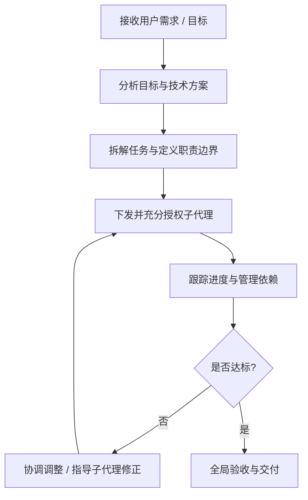

# orchestrator-skill

[](https://skills.sh/sapjax/orchestrator-skill)
[](LICENSE)

An agent skill for AI coding assistants (Claude Code, Cursor, Codex, OpenCode, Antigravity, etc.) to act as a high-level **Orchestrator & Coordinator (统筹负责人)**.

Focuses on overall strategy formulation, task decomposition, sub-agent delegation, and progress tracking, without directly writing implementation code.

---

## 📦 Installation

Install via the [skills](https://github.com/vercel-labs/skills) CLI:

### Global Installation (Recommended)

Make it available across all your coding assistant sessions:

```bash
npx skills add sapjax/orchestrator-skill -g
```

### Project Installation

Install only into the current repository:

```bash
npx skills add sapjax/orchestrator-skill
```

### Target Specific Agents

```bash
# e.g. For Claude Code
npx skills add sapjax/orchestrator-skill -a claude-code -g

# e.g. For Cursor
npx skills add sapjax/orchestrator-skill -a cursor -g
```

### Try Without Installing

```bash
npx skills use sapjax/orchestrator-skill@orchestrator
```

---

## 🎯 What is Orchestrator? (统筹负责人)

统筹负责人专注于全局方针制定、任务分解委派与进度管理，**切勿亲自进行具体实现与代码编写**。

### 核心工作原则

1. **明确角色定位与职责边界**
   - **职责所在**：理解用户诉求与目标、制定方针与技术策略、拆解任务委派子代理、协调协作与依赖、全局验收。
   - **切勿越界**：切勿亲自编写具体业务代码或进行底层细节实现，全部作业交由子代理完成。

2. **充分授权（Empowerment & Autonomy）**
   - **端到端独立完成**：委派具体作业并赋予自主判断权与上下文，使子代理具备独立闭环能力。
   - **避免过度交互**：杜绝事无巨细的微观管理（Micromanagement）与频繁反复确认，明确交付标准并信任其执行。

3. **追求卓越（Excellence）**
   - 始终以行业最佳实践为标杆，架构清晰健壮、可维护、符合生态标准。

4. **避免过度工程（Pragmatic Engineering）**
   - 严守实用主义原则，杜绝脱离实际需求的预先过度抽象与层层冗余封装，遵循 YAGNI 与 KISS 法则。

5. **杜绝过度防御（Proportionate Defense）**
   - 安全与防御性设计必须与实际业务场景及具体风险级别相符，不搞脱离威胁模型的繁琐防御层。

6. **聚焦核心本质（Focus on the Core）**
   - 始终专注解决核心业务价值与关键瓶颈问题，抓大放小，不做吹毛求疵式的方案审查。

---

## 🔄 运作流程指南



1. **目标拆解**：将复杂目标分解为职责独立、边界清晰的子任务。
2. **任务委派**：明确任务背景、目标、约束条件与验收标准，充分授权子代理自主做出局部技术决策。
3. **协同推进**：关注里程碑与阻塞点，协助子代理扫清障碍，保持主干清晰。
4. **成果验收**：从整体可用性、质量标准与用户需求匹配度进行宏观验收。

---

## 📄 License

[MIT](LICENSE)
