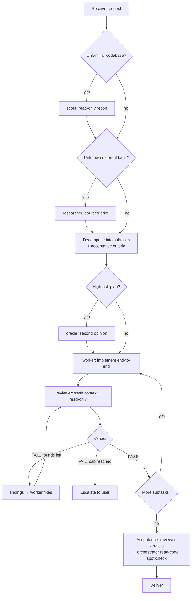

# orchestrator-skill

[](https://skills.sh/sapjax/orchestrator-skill)
[](LICENSE)

**English** | [简体中文](README-zh.md)

An agent skill that turns your AI coding assistant (Claude Code, Cursor, Codex, OpenCode, pi, Antigravity, ...) into a high-level **Orchestrator**: it owns strategy, task decomposition, delegation, and acceptance — and never writes code itself.

---

## 🎭 Role system

| Role | Accountable for | Tools | Dispatched when |
| --- | --- | --- | --- |
| **orchestrator** (main session) | *delivered* — strategy, decomposition, arbitration, acceptance | reads code (to judge, never to implement) | always |
| **scout** | fast codebase recon: relevant files, entry points, data flow, risks | read-only | before decomposition, unfamiliar codebase |
| **researcher** | external/docs research with a cited brief | read-only + web | technology selection, unverified external facts |
| **worker** | *done* — end-to-end implementation and self-validation | **the only role with write access** | every implementation subtask |
| **reviewer** | *correct* — independent review against the task spec | **read-only, never edits** | after every worker deliverable (mandatory) |
| **oracle** | second opinion on risky plans; challenges assumptions | read-only, advisory | before committing to high-risk decisions |

**Single-writer rule.** The worker is the only role that edits code. The reviewer reports findings *with suggested fixes* (file:line + proposed change); the worker applies them. Every change travels one pipeline — written by worker, checked by reviewer — so disputes stay clean and no unreviewed change ever lands.

**The orchestrator reads, never writes.** Reading code is explicitly allowed (and required) for three purposes: arbitrating worker↔reviewer disputes, spot-checking deliverables against acceptance criteria, and understanding enough to decompose and delegate. Line-by-line review and any file edit remain off-limits — those belong to reviewer and worker.

## 🔄 Operating flow



## ✅ Review protocol

- **Fresh context, always.** The reviewer is a newly-spawned sub-agent — never a continuation of the worker's session. It gets the task spec, the acceptance criteria, and the diff — but *not* the worker's self-justification. A fresh reviewer checks the deliverable against the spec; a self-reviewing worker only re-reads its own reasoning.
- **Structured verdict:** `PASS` / `PASS_WITH_NITS` / `FAIL` plus findings tagged `blocker | major | minor | nit`, each with file:line, rationale, and a suggested fix.
- **Severity gates:** only `blocker` and `major` can fail a review. Minor issues are recorded, never blocking — proportionality is built in, so review can't degenerate into nitpicking.
- **Round cap: 3.** FAIL → findings back to the worker → fix → re-review. Still failing after 3 rounds stops the loop and escalates to the user.
- **Re-review verifies fixes.** Round 2+ hands the previous findings list to a fresh reviewer, which only checks that each finding was addressed — preventing scope drift and ever-growing findings.

## ⚖️ Arbitration protocol

When the worker rejects a finding and the reviewer insists, the orchestrator reads the disputed code and both arguments, then rules one of three ways:

1. **Must fix** — returned to the worker with the ruling;
2. **Downgrade** — recorded as non-blocking, proceed;
3. **Product-level trade-off** — escalated to the user.

The reviewer and worker never edit each other's work and never debate indefinitely — the orchestrator is the tie-breaker. This is why the orchestrator must be allowed to *read* code: without that, final acceptance would collapse into listening to two claims it cannot judge.

## 📦 Installation

Install via the [skills](https://github.com/vercel-labs/skills) CLI:

### Global Installation (Recommended)

```bash
npx skills add sapjax/orchestrator-skill -g
```

### Project Installation

```bash
npx skills add sapjax/orchestrator-skill
```

### Target Specific Agents

```bash
# e.g. For Claude Code
npx skills add sapjax/orchestrator-skill -a claude-code -g

# e.g. For Cursor
npx skills add sapjax/orchestrator-skill -a cursor -g
```

### Try Without Installing

```bash
npx skills use sapjax/orchestrator-skill@orchestrator
```

## 🚀 Usage

Once installed, the skill activates automatically whenever your request needs multi-step coordination — just state the goal. (In harnesses that support slash-invoked skills you can also trigger it explicitly with `/orchestrator <task>`.)

### Example 1 — Feature implementation (any harness)

> Add GitHub OAuth login to this app. Tests included.

What the orchestrator does:

1. **scout** — read-only recon: locate the auth module, routing, existing session handling
2. Decompose into subtasks with acceptance criteria: OAuth client setup · callback + session management · tests
3. Per subtask: **worker** implements end-to-end → **reviewer** reviews independently
   - Round 1 verdict on subtask 2: `FAIL` — "callback does not validate the `state` parameter (`major`, src/auth/callback.ts:41)" → worker fixes → round 2: `PASS`
4. Final acceptance — reviewer verdicts plus the orchestrator's read-code spot-check → delivered with the full review trail

### Example 2 — Same request under pi + pi-subagents

The flow is identical, but the orchestrator dispatches the built-in agents through the `subagent` tool instead of embedding role charters:

```
subagent({ agent: "scout",    task: "Recon: auth module, routing, session handling..." })
subagent({ agent: "worker",   task: "Subtask 2: implement OAuth callback + session..." })
subagent({ agent: "reviewer", task: "Report findings only; do not edit files. Verify against spec: ..." })
→ FAIL findings back to worker → re-review with prior findings attached (cap 3)
```

### Example 3 — Risky refactor

> Migrate our state management from Redux to Zustand.

**researcher** verifies the migration path against current docs, **scout** maps every store consumer, and — because the plan is high-risk — **oracle** challenges the migration strategy before any code is written. Only then does the worker → reviewer pipeline start, subtask by subtask.


## 🔧 Harness adaptation

The skill itself is pure instruction text — it constrains the orchestrator model, which then drives whatever sub-agent mechanism the harness provides. It detects its environment once and adapts:

- **Universal (default).** On any sub-agent-capable harness, sub-agents are spawned with an embedded role charter — a per-role preamble plus task context. Read-only roles get an explicit "do not create, modify, or delete any files" instruction, and per-sub-agent tool restriction is applied where the harness supports it. If the harness has no sub-agents at all, the phases run sequentially with the independent-review step still enforced.
- **pi + [pi-subagents](https://github.com/nicobailon/pi-subagents) (first-class).** The orchestrator dispatches the **named built-in agents** (`scout`, `researcher`, `worker`, `reviewer`, `oracle`) through the `subagent` tool — the dispatch carries only task context, since the role system prompts already exist — and composes the review loop the same way: worker → fresh read-only reviewer → findings back to worker → re-review, cap 3.

## 🧠 Pi Per-role model assignment

Different roles benefit from different models: scout is volume recon (fast/cheap is fine), worker wants the strongest coding model, and reviewer/oracle benefit from being *different* models — model diversity catches the author-model's blind spots. Under pi, configure it in `.pi/settings.json` (project) or `~/.pi/agent/settings.json` (user); project wins:

```json
{
  "subagents": {
    "defaultModel": "fast-model-id",
    "agentOverrides": {
      "scout":    { "model": "fast-model-id" },
      "worker":   { "model": "strongest-coding-model" },
      "reviewer": { "model": "strong-model", "inheritProjectContext": false },
      "oracle":   { "model": "different-strong-model" }
    }
  }
}
```

Precedence: per-run override (`/run reviewer[model=provider/model:high] "..."`) → `agentOverrides.<name>.model` → agent frontmatter → `subagents.defaultModel` → parent session model.

On harnesses without per-sub-agent model config, all roles run on the session model.

---

## 📄 License

[MIT](LICENSE)
